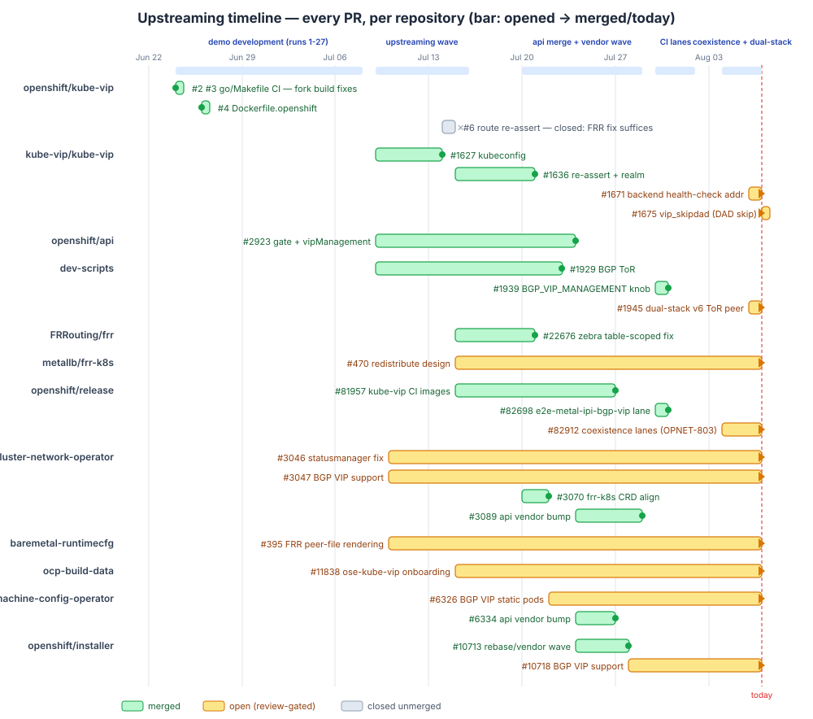
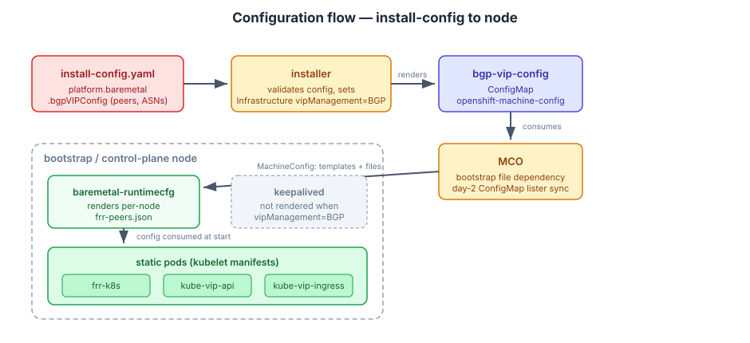
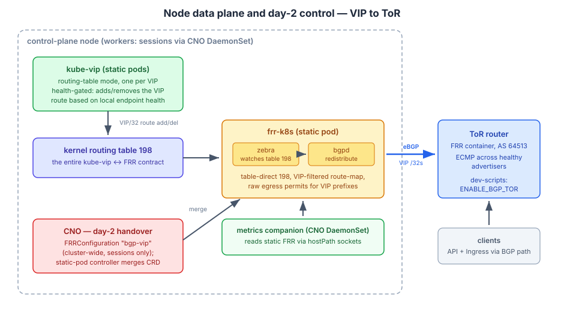

# BGP VIP Management — Dev Demo Workspace

Working demo and upstreaming workspace of
[openshift/enhancements#1982](https://github.com/openshift/enhancements/pull/1982)
(OPNET-595/OPNET-773): BGP-based VIP management for on-premise OpenShift —
kube-vip (routing-table mode) + frr-k8s static pods replacing keepalived.

**Status (2026-08-13): PoC COMPLETE, upstreaming in flight.**
All six demo criteria proven across 27 install runs (see
[docs/demo-results.md](docs/demo-results.md), [docs/RUN-LEDGER.md](docs/RUN-LEDGER.md)):
API + Ingress VIPs advertised via BGP from bootstrap through steady state,
health-gated per node, CRD handover, failover, full metrics coverage,
console over the BGP-routed path — most recently on a cluster deployed with
the one-click dev-scripts knob and verified by the CI lane's acceptance
script.

Upstream state:

- **Merged**: openshift/api#2923 (gate + `vipManagement` + `BGPVIPPeersJSON`),
  **baremetal-runtimecfg#395** (OPNET-785, FRR peer-file rendering,
  2026-08-13), the vendor wave (MCO#6334, CNO#3089, installer 1.36 rebase
  #10713), CNO#3070 (frr-k8s CRD asn fix), openshift/release#81957
  (kube-vip CI promotion) + #82698 (`e2e-metal-ipi-bgp-vip` CI lane) +
  **#82912** (coexistence + dual-stack lanes incl. the FRR runtime-state
  verify, OPNET-803, 2026-08-13), dev-scripts#1929 (BGP ToR) + #1939
  (`BGP_VIP_MANAGEMENT` knob), the full upstream kube-vip series
  kube-vip/kube-vip#1627 + #1636 + **#1671 + #1675** (kubeconfig,
  re-assert, backend health-check addr, vip_skipdad) and the
  openshift/kube-vip build PRs #2/#3/#4; FRRouting/frr#22654 fixed upstream
  via #22676. openshift/kube-vip#6 (route re-assertion) closed unmerged —
  the FRR fix suffices.
- **Open (review-gated, code complete)**: installer#10718 (OPNET-781),
  MCO#6326 (OPNET-782), CNO#3047 + #3046 (OPNET-783),
  ocp-build-data#11838 (OPNET-779), api#2972 (draft — TP `BGPVIPConfig`
  CRD), dev-scripts#1945 (dual-stack v6 ToR peer + full optional-field
  e2e coverage), metallb/frr-k8s#470 (redistribution API design).
  2026-08-12/13 review wave: cybertron's installer#10718 findings (FRR
  timers take bare seconds; peer `port` was dead code) fixed across all
  four repos, and the MCO e2e-openstack permafail root-caused to a
  bootstrap-vs-in-cluster image-source asymmetry (frr-k8s image from the
  payload vs the images ConfigMap) and fixed with parity regression tests.
- First combined multi-PR CI run executed (ledger row `ci-1`); sole blocker
  for a green lane is the kube-vip istag missing from the ocp/5.0
  integration stream (DPTP escalation on release#81957).

Full tracker: [docs/NEXT-STEPS.md](docs/NEXT-STEPS.md) (Jira subtask
mapping + PR tracker).

How the work landed over time — every PR across the twelve repositories,
from the June demo build-up through the July upstreaming and vendor waves
to the CI lane:

## Document map

| Doc | Purpose |
|-----|---------|
| [docs/demo-results.md](docs/demo-results.md) | Acceptance evidence + EP-relevant design findings |
| [docs/PATCHES.md](docs/PATCHES.md) | Every commit in every repo, with rationale; payload recipe; branch-state addendum |
| [docs/RUN-LEDGER.md](docs/RUN-LEDGER.md) | All 27 install runs + lab sessions + CI runs: what failed, what fixed it |
| [docs/RUNBOOK.md](docs/RUNBOOK.md) | Operational how-to: rebuild images, assemble payload, deploy, verify, debug; FRR provenance; kube-vip↔FRR positioning |
| [docs/NEXT-STEPS.md](docs/NEXT-STEPS.md) | Handoff: productization phases, PR tracker, EP corrections, upstreaming |
| [docs/compatibility-webhook-investigation.md](docs/compatibility-webhook-investigation.md) | Root-cause of the run24 cluster-wide CRD-write outage (networking, not the webhook) + filing guidance |
| [docs/kube-vip-art-onboarding.md](docs/kube-vip-art-onboarding.md) | ART payload-member onboarding for ose-kube-vip (OPNET-779) |
| [docs/frr-k8s-*.md](docs/) | frr-k8s feature request + redistribution design drafts (metallb/frr-k8s#469/#470) |
| [docs/superpowers/](docs/superpowers/) | Original design spec + 18-task implementation plan (historical) |

## Artifacts in this repo

| Path | What |
|------|------|
| `bgp-tor.sh`, `tor/` | FRR ToR container helper for the hypervisor (up/down/status); superseded in dev-scripts by `ENABLE_BGP_TOR` (#1929) |
| `patches/` | git-am-able patch series for the three repos with **open PRs** (installer, MCO, CNO) — historical form; the open PRs are the canonical carriers. Everything merged (api, runtimecfg#395, dev-scripts, FRR, the whole kube-vip series, vendor patches) removed; recoverable from git history |
| `build/` | Dockerfiles used for the demo image builds + FRR build script |
| `lab/` | Standalone FRR reproduction labs that isolated both zebra bugs without a cluster |

## The demo in two pictures

A single knob in install-config (`bgpVIPConfig`; `BGP_VIP_MANAGEMENT=true`
in dev-scripts) flows through the installer and MCO into per-node FRR peer
config and the three static pods, replacing keepalived:

On each node, kube-vip health-gates a VIP/32 route in kernel table 198;
frr-k8s redistributes that table into BGP toward the ToR. Day-2, CNO hands
over session config via a cluster-wide FRRConfiguration and runs the
metrics companion:

kube-vip and FRR never talk to each other — kernel table 198 is the entire
contract (see RUNBOOK "kube-vip↔FRR relationship"). FRR daemons come from
the FDP `frr10` RPM inside the `metallb-frr` image built from
github.com/openshift/frr (see RUNBOOK "FRR provenance").

## Where the code lives

Canonical carriers: **the open upstream PRs** (see tracker). Development
branches live in the migrated workspace on the demo host:
`root@metal-u15:/root/OPNET-595-BGP/git/github.com` (see `HANDOFF.md` there;
`/home/kmateusz/git/github.com` is symlinked for the dev-branch go.mod
replace paths).

| Repo | PR branch (canonical) | Dev/demo branch |
|---|---|---|
| openshift/api | merged (#2923) | `OPNET-595-bgp-vip-management` |
| installer | `opnet-781-bgp-vip` (#10718) | `OPNET-595-bgp-vip-management-vendored` |
| machine-config-operator | `OPNET-595-mco-pr` (#6326) | `OPNET-595-bgp-vip-management-dev` |
| cluster-network-operator | `bgp-vip-management` (#3047) | `OPNET-595-bgp-vip-management-vendored` (carries a now-redundant DEMO-CARRY; refresh on next demo rebuild) |
| baremetal-runtimecfg | merged (#395) | `OPNET-595-bgp-vip-management` |
| kube-vip | upstream #1627 #1636 #1671 #1675 merged; downstream #2/#3/#4 merged, #6 closed | `OPNET-595-bgp-vip-management` |
| dev-scripts | merged (#1929, #1939) | — |
| openshift/release | merged (#81957, #82698, #82912) | — |

Images: `quay.io/mkowalski/{machine-config-operator,cluster-network-operator,baremetal-runtimecfg,kube-vip,cluster-config-api,metallb-frr}:bgp-demo`,
payload `quay.io/mkowalski/ocp-release:bgp-vip-demo` (base
5.0.0-0.nightly-2026-07-20-081439).

Demo environment: `root@metal-u15` (dev-scripts at `/root/dev-scripts` with
the knob applied, demo config `config_root.sh`; ToR via `ENABLE_BGP_TOR`).

## CI

`e2e-metal-ipi-bgp-vip` (openshift/release#82698, merged): dev-scripts
install with `BGP_VIP_MANAGEMENT=true` + an acceptance-criteria verify step
(vipManagement=BGP, static pods/no keepalived, per-VIP BGP path counts at
the ToR, console 200 pinned to the ingress VIP). Optional on-demand
presubmit on openshift/installer; combined-stack runs via multi-PR testing
(`/testwith openshift/installer/main/e2e-metal-ipi-bgp-vip <PR refs...>`).
Red until the open PRs and the kube-vip istag land — by design.
Coexistence + dual-stack lanes (release#82912, merged): OVN-K route
advertisements, day-2 MetalLB, and the all-three-producers job, plus a
verify step asserting FRR runtime state at the ToR (sessions Established,
negotiated timers 90/30, BFD Up) against the optional peer fields the
dev-scripts knob now sets (#1945).
