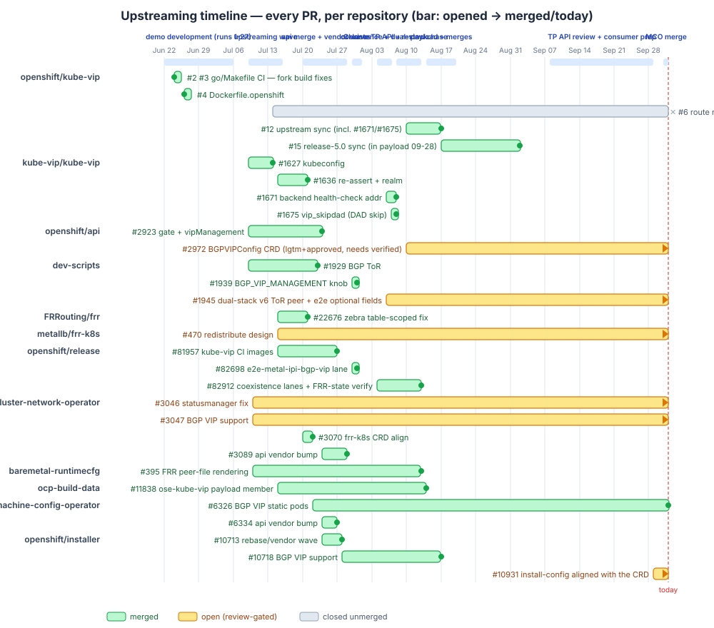
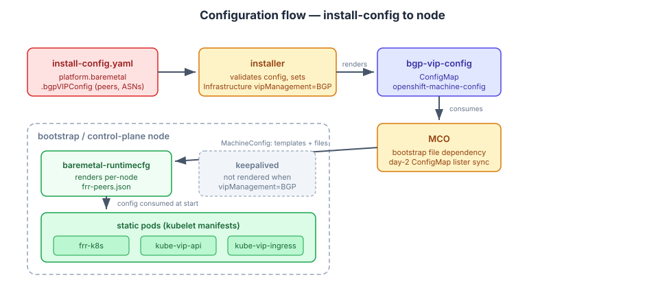
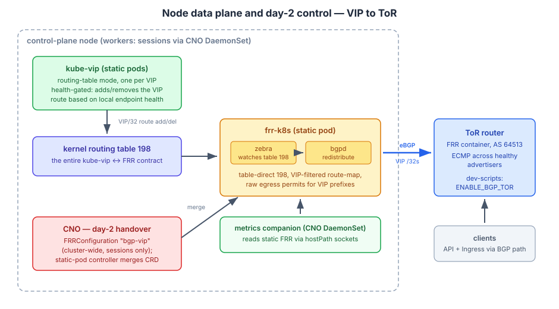
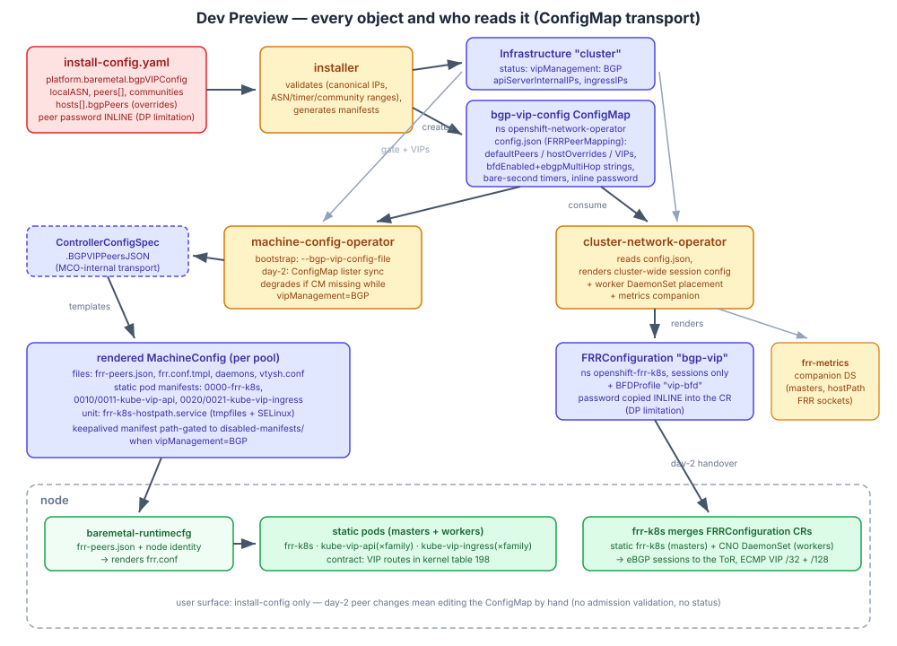
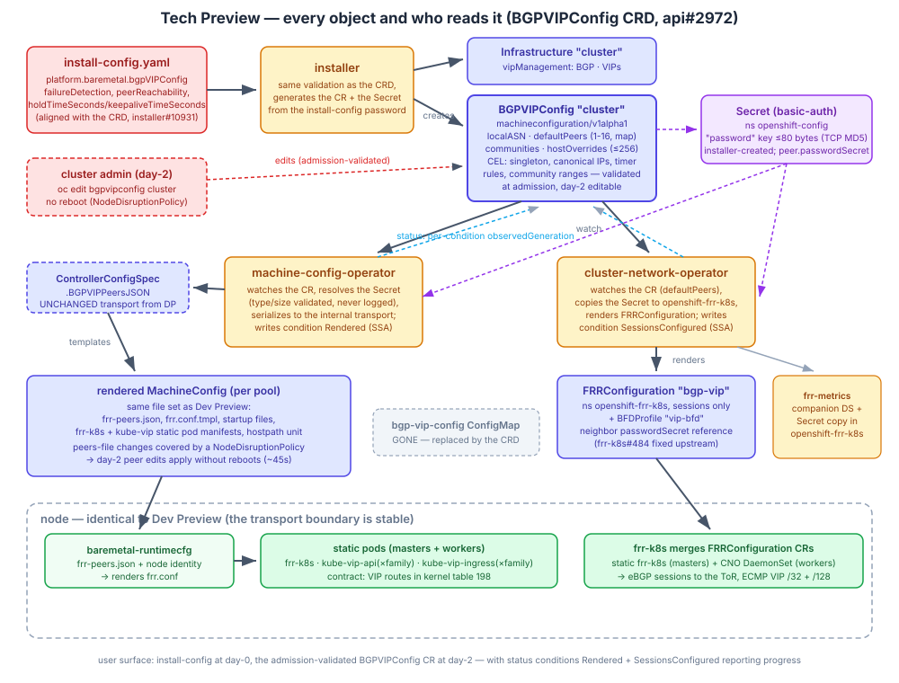

# BGP VIP Management — Dev Demo Workspace

Working demo and upstreaming workspace of
[openshift/enhancements#1982](https://github.com/openshift/enhancements/pull/1982)
(OPNET-595/OPNET-773): BGP-based VIP management for on-premise OpenShift —
kube-vip (routing-table mode) + frr-k8s static pods replacing keepalived.

**Status (2026-10-02): MCO merged — DevPreview is one merge away (CNO#3047, re-lgtm pending); TP structured API lgtm+approved, needs `verified`; frr-k8s redistribution design in maintainer review round 2.**
All six demo criteria proven across 27 install runs (see
[docs/demo-results.md](docs/demo-results.md), [docs/RUN-LEDGER.md](docs/RUN-LEDGER.md)):
API + Ingress VIPs advertised via BGP from bootstrap through steady state,
health-gated per node, CRD handover, failover, full metrics coverage,
console over the BGP-routed path — most recently on a cluster deployed with
the one-click dev-scripts knob and verified by the CI lane's acceptance
script.

Upstream state:

- **Merged**: **MCO#6326 (OPNET-782, 2026-10-02)** — BGP VIP static pods,
  bootstrap/day-2 ingestion, kube-vip payload consumption;
  **installer#10718 (OPNET-781, 2026-08-17)** — the feature's biggest PR; openshift/api#2923 (gate + `vipManagement` +
  `BGPVIPPeersJSON`), baremetal-runtimecfg#395 (OPNET-785),
  **ocp-build-data#11838 (OPNET-779)** — and since 2026-08-20 the
  **kube-vip image is in the 5.0 nightly + CI payloads** (the unblocker
  was the `io.openshift.release.operator=true` image label, kube-vip#17);
  the vendor wave (MCO#6334, CNO#3089, installer 1.36 rebase #10713),
  CNO#3070, openshift/release#81957 + #82698 (`e2e-metal-ipi-bgp-vip`) +
  #82912 (coexistence + dual-stack lanes + FRR runtime-state verify),
  dev-scripts#1929 + #1939, the full upstream kube-vip series (#1604,
  #1627, #1636, #1671, #1675), the downstream kube-vip syncs #12 + **#15
  (release-5.0, merged 2026-09-02 — in the payload since the 2026-09-28
  nightly: the dual-stack kube-vip prerequisite is complete)**, and the
  openshift/kube-vip build PRs #2/#3/#4, openshift/release#80926 + #81065
  (kube-vip onboarding + rebasebot); FRRouting/frr#22654 fixed
  upstream via #22676; metallb/frr-k8s#484 (passwordSecret
  merge-validation bug) fixed upstream. Closed/superseded along the way:
  installer#10710 (by #10713), CNO#3080 (dup of #3070), kube-vip#6 (FRR
  fix sufficed), kube-vip#14 (by #12).
- **Open (review-gated, code complete)**: CNO#3047 (OPNET-783 — had
  lgtm+approved; a rebase-artifact lint fix on 2026-10-02 dropped them,
  re-lgtm requested) + #3046 (cybertron review rounds addressed, awaiting
  re-review), api#2972 (TP `BGPVIPConfig` CRD — **lgtm + approved by
  everettraven 2026-10-02**, blocked only on the `verified` label),
  **installer#10931** (OPNET-810 —
  install-config peer fields aligned with the CRD shape; the generated
  ConfigMap transport contract deliberately unchanged via a dedicated
  frrPeerJSON type), dev-scripts#1945 (dual-stack v6 ToR peer +
  optional-field e2e — now ordered after installer#10931),
  metallb/frr-k8s#470 (redistribution API design), **MCO#6643**
  (OPNET-815 finding B — static-pod reloader writable `/tmp` +
  `/var/log/frr`; without it masters never apply day-2 FRRConfigurations),
  openshift/release#86746 (OPNET-815 EVPN coexistence lane), and the
  enhancement itself, openshift/enhancements#1982.
- Path to a green `e2e-metal-ipi-bgp-vip` lane: merge CNO#3047 (the last
  one), then `/testwith` needs no extra refs — installer, MCO, runtimecfg,
  and the payload image (incl. the dual-stack kube-vip fixes) are all
  merged.

Full tracker: [docs/NEXT-STEPS.md](docs/NEXT-STEPS.md) (Jira subtask
mapping + PR tracker).

How the work landed over time — every PR across the twelve repositories,
from the June demo build-up through the July upstreaming and vendor waves
to the CI lane:

## Document map

| Doc | Purpose |
|-----|---------|
| [docs/demo-results.md](docs/demo-results.md) | Acceptance evidence + EP-relevant design findings |
| [docs/PATCHES.md](docs/PATCHES.md) | Every commit in every repo, with rationale; payload recipe; branch-state addendum |
| [docs/RUN-LEDGER.md](docs/RUN-LEDGER.md) | All 27 install runs + lab sessions + CI runs: what failed, what fixed it |
| [docs/RUNBOOK.md](docs/RUNBOOK.md) | Operational how-to: rebuild images, assemble payload, deploy, verify, debug; FRR provenance; kube-vip↔FRR positioning |
| [docs/NEXT-STEPS.md](docs/NEXT-STEPS.md) | Handoff: productization phases, PR tracker, EP corrections, upstreaming |
| [docs/compatibility-webhook-investigation.md](docs/compatibility-webhook-investigation.md) | Root-cause of the run24 cluster-wide CRD-write outage (networking, not the webhook) + filing guidance |
| [docs/kube-vip-art-onboarding.md](docs/kube-vip-art-onboarding.md) | ART payload-member onboarding for ose-kube-vip (OPNET-779) |
| [docs/frr-k8s-*.md](docs/) | frr-k8s feature request + redistribution design drafts (metallb/frr-k8s#469/#470) |
| [docs/superpowers/](docs/superpowers/) | Original design spec + 18-task implementation plan (historical) |

## Artifacts in this repo

| Path | What |
|------|------|
| `bgp-tor.sh`, `tor/` | FRR ToR container helper for the hypervisor (up/down/status); superseded in dev-scripts by `ENABLE_BGP_TOR` (#1929) |
| `patches/` | git-am-able patch series for the one repo with an **open PR** (CNO) — historical form; the open PR is the canonical carrier. Everything merged (api, installer#10718, MCO#6326, runtimecfg#395, dev-scripts, FRR, the whole kube-vip series, vendor patches) removed; recoverable from git history |
| `build/` | Dockerfiles used for the demo image builds + FRR build script |
| `lab/` | Standalone FRR reproduction labs that isolated both zebra bugs without a cluster |

## The demo in two pictures

A single knob in install-config (`bgpVIPConfig`; `BGP_VIP_MANAGEMENT=true`
in dev-scripts) flows through the installer and MCO into per-node FRR peer
config and the three static pods, replacing keepalived:

On each node, kube-vip health-gates a VIP/32 route in kernel table 198;
frr-k8s redistributes that table into BGP toward the ToR. Day-2, CNO hands
over session config via a cluster-wide FRRConfiguration and runs the
metrics companion:

kube-vip and FRR never talk to each other — kernel table 198 is the entire
contract (see RUNBOOK "kube-vip↔FRR relationship"). FRR daemons come from
the FDP `frr10` RPM inside the `metallb-frr` image built from
github.com/openshift/frr (see RUNBOOK "FRR provenance").

## The API in two pictures — Dev Preview vs Tech Preview

Every object each phase creates (CRs, ConfigMaps, Secrets, MachineConfigs,
static pods) and who reads it. Dev Preview: the installer writes the
`bgp-vip-config` ConfigMap and both operators consume it — no admission
validation, no status, inline password:

Tech Preview (`BGPVIPConfig` CRD, openshift/api#2972): the ConfigMap is
gone — the installer generates the admission-validated, day-2-editable CR
plus a basic-auth Secret; the operators watch the CR and report progress
through status conditions. Everything below the MCO-internal transport is
byte-identical to Dev Preview — the node-side contract never moves:

## Where the code lives

Canonical carriers: **the open upstream PRs** (see tracker). Development
branches live in the migrated workspace on the demo host:
`root@metal-u15:/root/OPNET-595-BGP/git/github.com` (see `HANDOFF.md` there;
`/home/kmateusz/git/github.com` is symlinked for the dev-branch go.mod
replace paths).

| Repo | PR branch (canonical) | Dev/demo branch |
|---|---|---|
| openshift/api | merged (#2923) | `OPNET-595-bgp-vip-management` |
| installer | merged (#10718) | `OPNET-595-bgp-vip-management-vendored` |
| machine-config-operator | merged (#6326); open #6643 (reloader mounts) | `OPNET-595-bgp-vip-management-dev` |
| cluster-network-operator | `bgp-vip-management` (#3047) | `OPNET-595-bgp-vip-management-vendored` (carries a now-redundant DEMO-CARRY; refresh on next demo rebuild) |
| baremetal-runtimecfg | merged (#395) | `OPNET-595-bgp-vip-management` |
| kube-vip | upstream #1604 #1627 #1636 #1671 #1675 merged; downstream #2/#3/#4/#12/#15 merged, #6/#14 closed | `OPNET-595-bgp-vip-management` |
| dev-scripts | merged (#1929, #1939); open #1945 | — |
| openshift/release | merged (#80926, #81065, #81957, #82698, #82912); open #86746 (EVPN lane) | — |

Images: current run (5.1-evpn) uses `quay.io/mkowalski/ocp-release:bgp-vip-5.1`
(base 5.1.0-0.nightly-2026-10-06-091356 + only
`quay.io/mkowalski/cluster-network-operator:bgp-5.1` = CNO#3047+#3046;
everything else stock — MCO#6326 and installer#10718 are in the nightly).
Historical demo set: `quay.io/mkowalski/{machine-config-operator,cluster-network-operator,baremetal-runtimecfg,kube-vip,cluster-config-api,metallb-frr}:bgp-demo`,
payload `quay.io/mkowalski/ocp-release:bgp-vip-demo` (base
5.0.0-0.nightly-2026-07-20-081439).

Demo environment: `root@metal-u15` (dev-scripts at `/root/dev-scripts` with
the knob applied, demo config `config_root.sh`; ToR via `ENABLE_BGP_TOR`).

## CI

`e2e-metal-ipi-bgp-vip` (openshift/release#82698, merged): dev-scripts
install with `BGP_VIP_MANAGEMENT=true` + an acceptance-criteria verify step
(vipManagement=BGP, static pods/no keepalived, per-VIP BGP path counts at
the ToR, console 200 pinned to the ingress VIP). Optional on-demand
presubmit on openshift/installer; combined-stack runs via multi-PR testing
(`/testwith openshift/installer/main/e2e-metal-ipi-bgp-vip <PR refs...>`).
Red until the open PRs and the kube-vip istag land — by design.
Coexistence + dual-stack lanes (release#82912, merged): OVN-K route
advertisements, day-2 MetalLB, and the all-three-producers job, plus a
verify step asserting FRR runtime state at the ToR (sessions Established,
negotiated timers 90/30, BFD Up) against the optional peer fields the
dev-scripts knob now sets (#1945).

EVPN coexistence lane (release#86746, **open**, OPNET-815): installer
presubmit `e2e-metal-ipi-bgp-vip-ovn-bgp-evpn` composing the ovn-bgp flow
with the local-gateway migration and the **ovn-kubernetes OTE suite**
(43 EVPN tests via its baremetal infraprovider against the same route
reflector — the suite `e2e-metal-ipi-core-networking-dualstack-bgp-lgw-ote`
runs) plus a small verify step for the one thing that suite cannot cover:
the EVPN FRRConfiguration merged by the **static-pod frr-k8s** on a master,
its `l2vpn evpn` session, and a BGP-VIP regression guard with EVPN live.
IPv4 underlay only for now.

